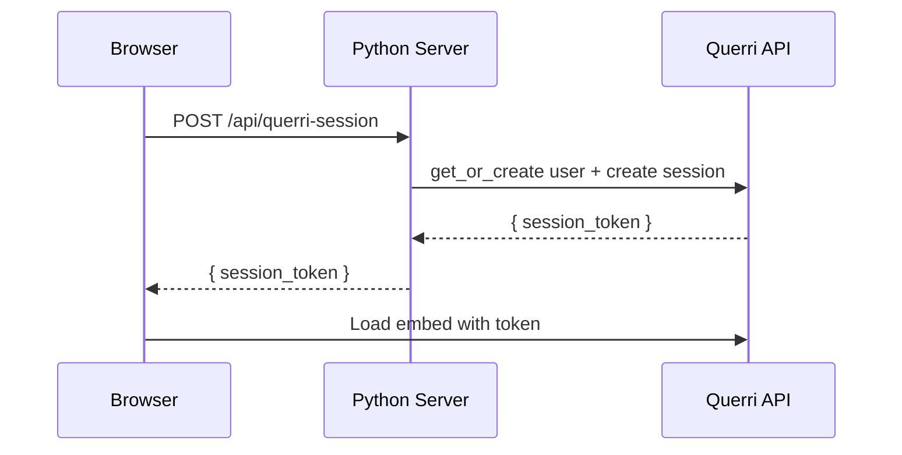

# querri — Python SDK

> Embed Querri analytics in your Python application. One method call, zero config.

**Flask** | **Django** | **FastAPI** | **Any Python framework**

Python SDK for creating embed sessions, managing users, and controlling access policies via the Querri API. Use it with any Python web framework alongside the [`@querri-inc/embed`](https://www.npmjs.com/package/@querri-inc/embed) frontend component. One `get_session()` call, one server endpoint, and you're done.

## Get Started in 60 Seconds

### 1. Install

```bash
pip install querri
```

### 2. Create a session

```python
from querri import Querri

client = Querri(api_key="qk_your_api_key", org_id="org_...")

session = client.embed.get_session(
    user="customer-42",  # external ID from your system
    ttl=3600,
)

print(session["session_token"])  # JWT to pass to the frontend
```

### 3. Add the embed (React)

```tsx
import { QuerriEmbed } from '@querri-inc/embed/react';

<QuerriEmbed
  style={{ width: '100%', height: '600px' }}
  serverUrl="https://app.querri.com"
  auth={{ sessionEndpoint: '/api/querri-session' }}
/>
```

### 4. Wire the endpoint

**Flask:**

```python
from flask import Flask, jsonify
from querri import Querri

app = Flask(__name__)
client = Querri()  # reads QUERRI_API_KEY from env

@app.route("/api/querri-session", methods=["POST"])
def querri_session():
    # In production, derive user identity from YOUR auth system.
    auth_user = get_authenticated_user()  # your auth logic

    session = client.embed.get_session(
        user={"external_id": auth_user.id, "email": auth_user.email},
        access={
            "sources": ["src_sales_data"],
            "filters": {"tenant_id": auth_user.tenant_id},
        },
        ttl=3600,
    )
    return jsonify(session)
```

**Django:**

```python
from django.http import JsonResponse
from django.views.decorators.http import require_POST
from django.contrib.auth.decorators import login_required
from querri import Querri

client = Querri()

@require_POST
@login_required
def querri_session(request):
    user = request.user
    session = client.embed.get_session(
        user={"external_id": str(user.id), "email": user.email},
        access={
            "sources": ["src_sales_data"],
            "filters": {"tenant_id": user.tenant_id},
        },
    )
    return JsonResponse(session)
```

**FastAPI:**

```python
from fastapi import FastAPI, Depends
from querri import AsyncQuerri

app = FastAPI()

@app.post("/api/querri-session")
async def querri_session(user=Depends(get_current_user)):
    async with AsyncQuerri() as client:
        session = await client.embed.get_session(
            user={"external_id": user.id, "email": user.email},
            access={
                "sources": ["src_sales_data"],
                "filters": {"tenant_id": user.tenant_id},
            },
        )
    return session
```

Set `QUERRI_API_KEY` and `QUERRI_ORG_ID` [environment variables](#configuration). In production, always derive user identity from your auth system — never from the request body.

### 5. Done.

The embed handles auth, token caching, and cleanup automatically.



> **Security:** Always derive user identity and access from your server-side auth system. Never read `user` or `access` from the request body — a malicious client can impersonate any user or escalate access.

## Configuration

The SDK reads configuration from constructor arguments or environment variables:

| Parameter | Env Variable | Default | Description |
|-----------|-------------|---------|-------------|
| `api_key` | `QUERRI_API_KEY` | *(required)* | Your `qk_` API key |
| `org_id` | `QUERRI_ORG_ID` | *(required)* | Organization ID |
| `host` | `QUERRI_HOST` | `https://app.querri.com` | Server host |
| `timeout` | `QUERRI_TIMEOUT` | `30.0` | Request timeout (seconds) |
| `max_retries` | `QUERRI_MAX_RETRIES` | `3` | Retry attempts for transient errors |

```python
# Read from environment variables
client = Querri()

# Explicit config
client = Querri(
    api_key="qk_...",
    org_id="org_...",
    host="http://localhost",  # for local development
    timeout=60.0,
    max_retries=5,
)
```

> **Note:** The parameter is `host`, not `base_url`. The SDK appends `/api/v1` automatically.

## `get_session()` — Embed Sessions

The flagship method that creates an embed session in three steps:

1. **User resolution** — creates or retrieves a Querri user by your external ID
2. **Access policy** — auto-creates or reuses a deterministic policy with row-level filters
3. **Session creation** — generates a JWT token for the embed iframe

### With inline access rules

```python
session = client.embed.get_session(
    user={
        "external_id": "customer-42",
        "email": "alice@acme.com",
        "first_name": "Alice",
    },
    access={
        "sources": ["src_sales_data"],
        "filters": {
            "tenant_id": "acme",
            "region": ["us-east", "us-west"],  # list values are OR'd
        },
    },
    origin="https://app.acme.com",
    ttl=7200,
)
```

### With pre-created policy IDs

```python
session = client.embed.get_session(
    user={"external_id": "customer-42"},
    access={"policy_ids": ["pol_abc123", "pol_def456"]},
)
```

### Return value

```python
session["session_token"]   # str — JWT for the embed
session["expires_in"]      # int — seconds until expiry
session["user_id"]         # str — Querri user ID
session["external_id"]     # str | None — your external ID

# JSON-serializable for API responses
return jsonify(session)  # Flask
return JsonResponse(session)  # Django
return session  # FastAPI
```

## User-Scoped Client (`as_user`)

Create a client that operates as a specific embed user. Resources are automatically filtered by FGA (Fine-Grained Authorization):

```python
session = client.embed.get_session(user="customer-42", ttl=900)

with client.as_user(session) as user_client:
    # Only returns resources the user has access to
    for project in user_client.projects.list():
        print(project.name)
    for dashboard in user_client.dashboards.list():
        print(dashboard.name)
```

See **[docs/server-sdk.md](docs/server-sdk.md#user-scoped-client-as_user)** for details on granting access and available resources.

## Direct Resource Usage

For advanced use cases, access the API resources directly:

### Users

```python
user = client.users.get_or_create(
    external_id="ext-123",
    email="user@example.com",
    role="member",
)

user = client.users.get("usr_abc123")

for user in client.users.list():
    print(user.email)

client.users.update("usr_abc123", first_name="Alice")
client.users.delete("usr_abc123")
```

### Policies

```python
policy = client.policies.create(
    name="APAC Sales",
    source_ids=["src_1"],
    row_filters=[{"column": "region", "values": ["APAC"]}],
)

client.policies.assign_users(policy.id, user_ids=["usr_abc123"])
client.policies.remove_user(policy.id, "usr_abc123")

# Atomically replace all policies for a user
client.policies.replace_user_policies("usr_abc123", policy_ids=["pol_1", "pol_2"])

# Convenience: create + assign in one call
policy = client.policies.setup(
    name="APAC Sales",
    sources=["src_1"],
    row_filters={"region": ["APAC"]},
    users=["usr_abc123"],
)
```

### Embed Sessions

```python
session = client.embed.create_session(user_id="usr_abc123", ttl=3600)
refreshed = client.embed.refresh_session(session.session_token)
client.embed.revoke_session(session.session_token)
client.embed.revoke_user_sessions("usr_abc123")
```

### Chat Streaming

```python
chat = client.projects.chats.create(project.id, name="Analysis")

# Stream response chunk by chunk
stream = client.projects.chats.stream(
    project.id, chat.id,
    prompt="Summarize sales by region",
    user_id="usr_...",
)
for chunk in stream:
    print(chunk, end="", flush=True)

# Or get full text at once
full_text = stream.text()
```

### All Resources

Beyond the core embed resources above, the SDK provides full access to the Querri API:

| Resource | Access | Key Methods |
|----------|--------|-------------|
| `client.dashboards` | Dashboard management | `list`, `create`, `get`, `update`, `delete`, `refresh` |
| `client.projects` | Analysis projects | `list`, `create`, `get`, `run`, `run_status`, `list_steps` |
| `client.projects.chats` | Chats within projects | `create`, `list`, `stream`, `cancel`, `delete` |
| `client.data` | Data sources & queries | `sources`, `create_source`, `query`, `append_rows`, `replace_data` |
| `client.sources` | Connectors & sync | `list_connectors`, `list`, `create`, `sync` |
| `client.files` | File management | `upload`, `list`, `get`, `delete` |
| `client.keys` | API key management | `create`, `list`, `get`, `delete` |
| `client.audit` | Audit log | `list` |
| `client.usage` | Usage metrics | `org_usage`, `user_usage` |
| `client.sharing` | Sharing & permissions | `share_project`, `share_dashboard`, `share_source` |

See **[docs/server-sdk.md](docs/server-sdk.md)** for complete method signatures and examples.

## Error Handling

All errors extend `QuerriError`. API errors are mapped to specific exception types:

```
QuerriError
├── APIError                — HTTP error responses
│   ├── ValidationError     — 400
│   ├── AuthenticationError — 401
│   ├── PermissionError     — 403
│   ├── NotFoundError       — 404
│   ├── ConflictError       — 409
│   ├── RateLimitError      — 429 (auto-retried)
│   └── ServerError         — 5xx (auto-retried)
├── StreamError             — SSE stream issues
│   ├── StreamTimeoutError
│   └── StreamCancelledError
└── ConfigError             — missing/invalid configuration
```

```python
from querri import (
    APIError, AuthenticationError, RateLimitError, ConfigError,
)

try:
    session = client.embed.get_session(user="customer-42")
except AuthenticationError:
    # 401 — invalid API key
    print("Auth failed")
except RateLimitError as e:
    # 429 — rate limited (auto-retried up to max_retries)
    print(f"Rate limited, retry after: {e.retry_after}s")
except APIError as e:
    # Any other API error
    print(f"API error {e.status}: {e.message}")
    print(f"Request ID: {e.request_id}")
except ConfigError as e:
    # Missing API key or invalid config
    print(e.message)
```

The SDK automatically retries **429** (always) and **5xx** (idempotent methods only) with exponential backoff + jitter, up to `max_retries` attempts.

## Async Client

The `AsyncQuerri` client mirrors the sync API with `async`/`await`:

```python
import asyncio
from querri import AsyncQuerri

async def main():
    async with AsyncQuerri() as client:
        # Auto-paginate
        async for project in client.projects.list():
            print(project.name)

        # get_session works the same way
        session = await client.embed.get_session(
            user={"external_id": "cust-42", "email": "a@b.com"},
            access={"sources": ["src_sales"]},
        )

asyncio.run(main())
```

> **Async pagination note:** `AsyncCursorPage` doesn't have a `.data` property. Use `await page.get_data()` to fetch the first page, or `async for item in page` to auto-paginate.

## Example App

See [`examples/web-embed/`](examples/web-embed/) for a complete working example with a Python backend (Flask) and Querri embed frontend, including an interactive SDK explorer.

See [`examples/`](examples/) for individual scripts covering every SDK feature.

## Full Reference

See **[docs/server-sdk.md](docs/server-sdk.md)** for the complete API reference, including every method signature, framework integration guides (Flask, Django, FastAPI), error handling details, and the `get_session()` deep dive.

## Troubleshooting

### "No API key provided" error

Set the `QUERRI_API_KEY` environment variable. Find your API key at [app.querri.com/settings/api-keys](https://app.querri.com/settings/api-keys).

```bash
export QUERRI_API_KEY=qk_your_api_key
export QUERRI_ORG_ID=org_your_org_id
```

### Embed is blank / session endpoint returns 500

Verify your endpoint returns JSON. In Flask use `jsonify()`, in Django use `JsonResponse()`:

```python
# Flask
return jsonify(session)

# Django
return JsonResponse(session)

# FastAPI (automatic)
return session
```

### CORS errors in development

Use a reverse proxy to serve both your frontend and API from the same origin:

```python
# Vite dev proxy (vite.config.ts)
server: { proxy: { '/api': 'http://localhost:5050' } }
```

### ImportError: No module named 'querri'

Install the SDK:

```bash
pip install querri
```

## Important Notes

- This SDK uses the **Server Token** auth mode. Your Python backend creates session tokens and the frontend embed consumes them. For other auth modes (Share Key, Popup Login), see the [JS SDK docs](https://www.npmjs.com/package/@querri-inc/embed).
- **React/Vue/Angular:** Memoize the `auth` prop if it's an object. A new object reference on every render cycle causes the iframe to be destroyed and recreated.
- The Python SDK covers the full Querri API (all 13 resources). For frontend-only use cases, see the [JS SDK](https://www.npmjs.com/package/@querri-inc/embed).

## Requirements

- Python 3.9+
- [`httpx`](https://www.python-httpx.org/) >= 0.27
- [`pydantic`](https://docs.pydantic.dev/) >= 2.0

## Development

```bash
pip install -e ".[dev]"
pytest tests/ -v
pytest tests/test_integration.py -m integration -v  # requires API credentials
```

## License

MIT
